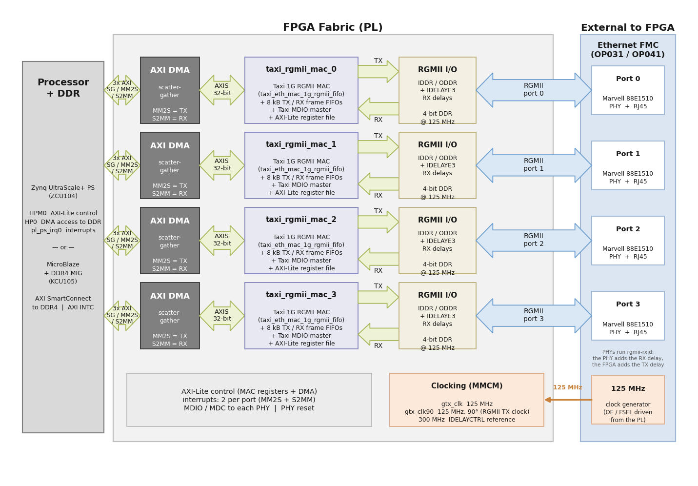

# Description

In this reference design, each port of the [Ethernet FMC] is driven by a **1G RGMII MAC from the
open-source [Taxi] transport library**, connected to the system memory via an AMD AXI DMA. The
AXI Ethernet Subsystem of our other Ethernet FMC designs is not used, so the design needs **no
separately-licensed AMD IP** (no Tri-Mode Ethernet MAC license), and the complete source of the
MAC is in the repository for you to read, simulate and modify.

## Block diagram

Reading a port row from left to right:

* **AXI DMA.** One scatter-gather AXI DMA per port carries frames between system memory and
  the MAC on a 32-bit AXI4-Stream (MM2S transmits, S2MM receives). Its three AXI masters
  (scatter-gather, MM2S, S2MM) reach DDR through `S_AXI_HP0_FPD` on the Zynq UltraScale+
  targets, or through the DDR4 memory controller on the MicroBlaze targets.
* **`taxi_rgmii_mac_N`.** The block-design module reference that bundles the Taxi 1G RGMII MAC
  (`taxi_eth_mac_1g_rgmii_fifo`) with its 8 kB transmit and receive frame FIFOs, a Taxi MDIO
  master for the port's PHY and an AXI4-Lite register file — described in detail below.
* **RGMII I/O.** The wire side of the MAC is RGMII: 4-bit DDR data at 125 MHz, driven by ODDR
  primitives on transmit and captured by IDDR primitives on receive, each receive pin passing
  through an IDELAYE3 whose delay is tuned per port and calibrated by an IDELAYCTRL.
* **Clocking.** An MMCM derives `gtx_clk` (125 MHz), `gtx_clk90` (the 90-degree copy used as the
  RGMII transmit clock) and the 300 MHz IDELAYCTRL reference from the 125 MHz clock that the
  Ethernet FMC's clock generator supplies through the FMC connector.
* **The PHYs.** Each port ends on the mezzanine card in a Marvell 88E1510 PHY and its RJ45
  connector, managed over that port's own MDIO bus.

The block design (`Vivado/src/bd/bd_zynqmp.tcl`) is built from:

* **Processing system**: `M_AXI_HPM0_FPD` carries the AXI-Lite control path to the MAC and DMA
  registers, `S_AXI_HP0_FPD` gives the DMAs access to DDR (through one SmartConnect),
  `pl_ps_irq0` collects the eight DMA interrupts (MM2S + S2MM per port), and TTC0 on EMIO is the
  tick timer of the lwIP echo server.
* **Per port, four times**: a `taxi_rgmii_mac_N` cell and an `axi_dma_N`. The DMA's MM2S stream
  feeds frames to transmit into the MAC, the MAC's receive stream feeds the DMA's S2MM channel.
  The DMA is configured with scatter-gather, 32-bit streams and unaligned transfers (lwIP pbufs
  are not word aligned).
* **Clocking**: a clocking wizard takes the 125 MHz reference clock that the Ethernet FMC
  generates and produces the 125 MHz RGMII transmit clock (`gtx_clk`), a copy shifted by 90
  degrees (`gtx_clk90`, which becomes the RGMII TX clock so that the data has a centred
  transmit delay) and a 300 MHz reference for the IDELAYCTRL that calibrates the receive-side
  input delays. Two constants drive the FMC's clock generator: `ref_clk_oe` = 1 enables it and
  `ref_clk_fsel` = 1 selects 125 MHz.
* **The PHYs**: each port of the Ethernet FMC has a Marvell 88E1510 PHY at MDIO address 0 on its
  own MDIO bus. They are configured for `rgmii-rxid`: the PHY adds the receive clock delay and
  the FPGA adds the transmit clock delay, which the software (lwIP netif and Linux driver) sets
  up over MDIO.

## The Taxi RGMII MAC block

`taxi_rgmii_mac` (`Vivado/src/hdl/taxi_rgmii_mac.v` + `taxi_rgmii_mac_core.sv`) is a
block-design *module reference* — a plain RTL module that Vivado packages as a block-design cell
with AXI-Lite, AXI-Stream, RGMII and MDIO interfaces. It bundles three things:

1. **The Taxi 1G RGMII MAC** (`taxi_eth_mac_1g_rgmii_fifo`): the MAC with its RGMII PHY
   interface, IDDR/ODDR I/O primitives, optional receive-side IDELAYs, and asynchronous FIFOs
   that cross from the 125 MHz transmit / recovered receive clocks to the AXI clock domain. It
   appends the FCS on transmit and strips it on receive, drops bad-FCS and oversize frames in
   hardware, and has no address filter (the software receives everything on the wire).
2. **A Taxi MDIO master** (`taxi_mdio_master`) for the port's PHY management bus.
3. **A small AXI4-Lite register file** (Opsero, MIT) that exposes control, status, the error
   flags, statistics counters and the MDIO master to software.

The register map (byte offsets, 32-bit registers; the authoritative version is the header of
`Vivado/src/hdl/taxi_rgmii_mac.v`):

| Offset | Register     | Access | Contents |
|--------|--------------|--------|----------|
| 0x00   | ID           | RO     | 0x54415849 ("TAXI") |
| 0x04   | VERSION      | RO     | 0x00010000 |
| 0x08   | CTRL         | RW     | [0] tx_enable, [1] rx_enable, [2] phy_reset_n, [3] tx_pad_en (all default 1) |
| 0x0C   | STATUS       | RO     | [1:0] link speed (00 = 10M, 01 = 100M, 10 = 1G), [8] MDIO busy |
| 0x10   | FLAGS        | W1C    | tx_underflow, tx_fifo_overflow, tx_fifo_bad_frame, rx_fifo_overflow, rx_fifo_bad_frame, rx_bad_fcs |
| 0x14   | TX_IFG       | RW     | inter-frame gap in bytes (12) |
| 0x18   | TX_MAX_LEN   | RW     | max TX frame length on the wire incl. FCS, minus 1 (1517) |
| 0x1C   | RX_MAX_LEN   | RW     | max RX frame length on the wire incl. FCS, minus 1 (1517) |
| 0x20–0x34 | RX_GOOD_CNT, RX_BAD_CNT, TX_GOOD_CNT, TX_BAD_CNT, RX_OVF_CNT, TX_OVF_CNT | RO/WC | statistics counters (write clears) |
| 0x40   | MDIO_CMD     | WO     | Clause 22 frame: [29:28] op (01 write, 10 read), [27:23] PHY address, [22:18] register, [15:0] write data |
| 0x44   | MDIO_RDATA   | RO     | data of the last completed read |
| 0x48   | MDIO_STATUS  | RO     | [0] busy, [1] read data valid, [2] command dropped |
| 0x4C   | MDIO_DIV     | RW     | MDC half-period in AXI clock cycles minus 1 (19 → 2.5 MHz MDC at 100 MHz) |

The module parameters (set in the block design) select the DMA-side stream width
(`AXIS_DATA_W`, 32), the FIFO depths (8 kB each way), the device family string that the Taxi
I/O primitives use (`FAMILY`), whether the FPGA generates the 90-degree transmit clock delay
(`USE_CLK90` = 1) and the receive-side IDELAY (`RX_IDELAY_PS`, 1100 ps on the ZCU104, with a
300 MHz `IDELAY_REFCLK_MHZ`).

## Hardware Platforms

The hardware designs provided in this reference are based on Vivado and support the MPSoC
evaluation boards listed below. The repository contains all necessary scripts and code to build
these designs for the supported platforms:


    
    
        
            
        
    
    
### {{ group.name }} platforms

| Target board        | FMC Slot Used | Supported Num. Ports   | Standalone  Echo Server | Yocto |
|---------------------|---------------|---------|-----|-----|
| [{{ design.board }}]({{ design.link }}) | {{ design.connector }} | {{ design.lanes | length }}x |  ✅  ❌  |  ✅  ❌  |




## Software

These reference designs can be driven by either a standalone application or within an embedded
Linux environment built with AMD's Yocto / Embedded Development Framework (EDF) flow. The
repository includes all necessary scripts and code to build both environments. The table
below outlines the corresponding applications available in each environment:

| Environment      | Available Applications  |
|------------------|-------------------------|
| Standalone       | lwIP echo server on all four ports (custom lwIP network interface for the Taxi MAC + AXI DMA) |
| Linux (Yocto)    | `taxi_mac` network driver (one interface per port), `taxi-eth-test` self-test Additional tools: ethtool, iproute2, iperf3, i2c-tools, phytool, pktgen |

## Licensing

Everything that Opsero wrote — the MAC wrapper and its register file, the block design, the
constraints, the software and the build scripts — is published under the **MIT license**. The
Taxi transport library is a git submodule (`submodules/taxi`) and is licensed under the
**CERN-OHL-S-2.0**, the *strongly reciprocal* CERN Open Hardware Licence (FPGA Ninja also offers
a commercial license). If you distribute a product — including a bitstream — that contains the
Taxi sources or a design derived from them, you must make the complete source of that design
available under the same license on request. The MIT-licensed parts of this repository do not
change that obligation for the Taxi-derived part of the design. The repository's
[`submodules/README.md`](https://github.com/fpgadeveloper/ethernet-fmc-taxi-eth/blob/master/submodules/README.md)
lists exactly which Taxi modules the design uses and what the license means for you.

[Ethernet FMC]: https://docs.opsero.com/op031/datasheet/overview/
[Taxi]: https://github.com/fpganinja/taxi
