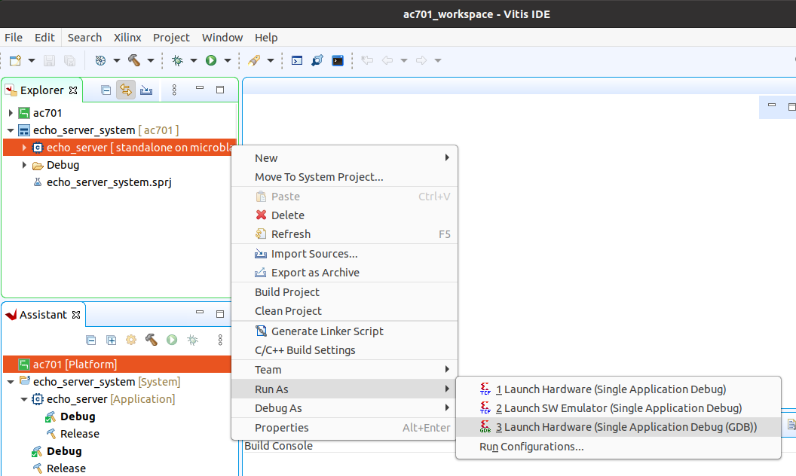

# Stand-alone lwIP Echo Server

The standalone application runs an lwIP TCP echo server on **all four ports** of the [Ethernet FMC]
at the same time. It is a custom application (not the stock Vitis `lwip_echo_server` template),
because the AMD lwIP port has no network-interface driver for the Taxi MAC: the sources in
`Vitis/common/src` provide one.

| File | Role |
|------|------|
| `main.c` | Brings up the four ports, runs the lwIP timers from a 50 ms tick and polls the ports for received frames |
| `taxi_macif.c` / `.h` | The lwIP `netif` driver for one port: Taxi MAC + AXI DMA scatter-gather rings (64 TX / 64 RX descriptors), MDIO PHY setup (`rgmii-rxid`, autonegotiation) and link polling |
| `taxi_mac.c` / `taxi_mac.h` / `taxi_mac_hw.h` | Register-level access to the `taxi_rgmii_mac` block: control/status, counters, MDIO master; `taxi_mac_hw.h` carries the per-port base addresses derived from the XSA |
| `echo.c` | The TCP echo server from the AMD template (one server on TCP port 7, bound to `IP_ANY_TYPE`, so it accepts connections on every port) |

The build driver (`Vitis/py/build-vitis.py`, configured by `Vitis/py/args.json`) creates a Vitis
platform from the exported XSA with the `lwip220` and `xiltimer` BSP libraries (interval timer on
TTC0), an empty application populated from `Vitis/common/src`, and packages `BOOT.BIN`.

## Building the Vitis workspace

To build the Vitis workspace and the application, you must first generate
the Vivado project hardware design (the bitstream) and export the hardware.
Once the bitstream is generated and exported, then you can build the
Vitis workspace using the provided scripts. Follow the
[build instructions](/build_instructions.md#build-vitis-workspace) — the
steps are the same on Windows and Linux; `./build.sh standalone --target <target>`
does both and gathers the boot file in `Vitis/boot/<target>/`.

## Run the application

There are two ways to run the application; both need the [Ethernet FMC] on the FMC connector of
the target board and the USB-UART connected to your PC (see [UART settings](#uart-settings)).

What the boot files are depends on the processor of the target:

| Target | Boot files in `Vitis/boot/<target>/` | How it is loaded |
|--------|--------------------------------------|------------------|
| `zcu104` (Zynq UltraScale+, hard PS) | `BOOT.BIN` | SD card, or JTAG from Vitis |
| `kcu105` (Kintex UltraScale, MicroBlaze) | `taxieth.bit` + `echo_server.elf` | JTAG only (no FSBL, no `BOOT.BIN`) |

### From an SD card (ZCU104)

This is the Zynq UltraScale+ path; the MicroBlaze targets have no SD boot — see
[from Vitis or xsct over JTAG](#from-vitis-or-xsct-over-jtag) below.

Copy `Vitis/boot/zcu104/BOOT.BIN` onto a FAT-formatted SD card, insert it into the board, set
the boot-mode switches to SD card (ZCU104: SW6 = `1000`, 1 = ON, 2 = OFF, 3 = OFF, 4 = OFF) and
power the board. The FSBL programs the FPGA and starts the application.

```{note}
On the ZCU104 the FSBL is what powers the FMC (VADJ), and the stock 2025.2 FSBL gets that wrong —
see [supported carriers](supported_carriers.md#zcu104). The standalone flow builds its platform
with the patched FSBL shipped in `EmbeddedSw/lib/sw_apps/zynqmp_fsbl/` (registered as a local
embedded-software repository by the build scripts), so the `BOOT.BIN` it produces powers the FMC.
```

### From Vitis or xsct over JTAG

1. Launch the Vitis GUI.
2. When asked to select the workspace path, select the `Vitis/<target>_workspace` directory.
3. Set the board to boot from JTAG (ZCU104: SW6 = `1111`; KCU105: SW15 switch 5 **OFF**, switch 6
   **ON**), power it up and ensure that the JTAG is connected properly.
4. In the Vitis Explorer panel, double-click on the System project that you want to run -
   this will reveal the application contained in the project. The System project will have 
   the postfix "_system".
5. Now right click on the application "echo_server" then navigate the
   drop down menu to **Run As->Launch on Hardware (Single Application Debug (GDB)).**.



The run configuration will first program the FPGA with the bitstream, then load and run the 
application. You can view the UART output of the application in a console window. On a ZynqMP
target the Zynq MP First Stage Boot Loader banner comes first, then the application prints one
line per port:

```
----- Ethernet FMC Taxi MAC lwIP echo server (4 ports) -----
MAC: Taxi 1G RGMII (taxi_rgmii_mac) + AXI DMA SG, PHY: Marvell 88E1510
Waiting up to 5000 ms for autonegotiation...

port 0: MAC 00:0a:35:06:21:05  IP 192.168.1.10 mask 255.255.255.0 gw 192.168.1.1  link up 1000 Mbps
port 1: MAC 00:0a:35:06:21:06  IP 192.168.1.11 mask 255.255.255.0 gw 192.168.1.1  link down
port 2: MAC 00:0a:35:06:21:07  IP 192.168.1.12 mask 255.255.255.0 gw 192.168.1.1  link down
port 3: MAC 00:0a:35:06:21:08  IP 192.168.1.13 mask 255.255.255.0 gw 192.168.1.1  link down

-----lwIP TCP echo server ------
TCP packets sent to port 6001 will be echoed back
TCP echo server started @ port 7
```

The application waits up to 5 seconds for the ports that have a cable to complete
autonegotiation; a port whose cable is plugged in later is picked up by the once-a-second link
poll, so ports can be connected in any order.

This is the UART output of the ZCU104 with port 0 of the Ethernet FMC cabled to a router that
runs a DHCP server (the other three ports unplugged):

```
Zynq MP First Stage Boot Loader
Release 2025.2   Sep 23 2026  -  17:54:01
PMU-FW is not running, certain applications may not be supported.
----- Ethernet FMC Taxi MAC lwIP echo server (4 ports) -----
MAC: Taxi 1G RGMII (taxi_rgmii_mac) + AXI DMA SG, PHY: Marvell 88E1510
Addressing: DHCP per port, static 192.168.1.10+N fallback after 10 s
Port 0: MAC 00:0A:35:06:21:05
Port 1: MAC 00:0A:35:06:21:06
Port 2: MAC 00:0A:35:06:21:07
Port 3: MAC 00:0A:35:06:21:08
Waiting up to 5000 ms for autonegotiation...
Port 0: link up, 1000 Mbps full duplex (MAC in-band status: 1000 Mbps)
Port 0: DHCP started
-----lwIP TCP echo server ------
TCP packets sent to port 7 will be echoed back
TCP echo server started @ port 7
Port 0: IP 192.168.2.125 mask 255.255.255.0 gw 192.168.2.1 (DHCP)
Port 0: rx delivered 74, tx sent 3
```

The `rx delivered / tx sent` line is printed whenever a port's frame counts change, so you can
see traffic arriving even before an address is assigned.

#### Without the GUI: xsct

The same load can be driven from the command line, which is how a MicroBlaze target such as the
KCU105 is usually run — JTAG is the only way to load it. Source the Vitis settings script, start
`xsct` and run:

```tcl
connect
targets -set -filter {name =~ "xcku*"}
fpga -f Vitis/boot/kcu105/taxieth.bit
targets -set -filter {name =~ "MicroBlaze #*"}
dow Vitis/boot/kcu105/echo_server.elf
con
```

`fpga` configures the FPGA, `dow` downloads the ELF into DDR4 and `con` starts the processor;
the application begins printing on the UART immediately. On a Zynq UltraScale+ target the
sequence is different (the FSBL has to run first to bring up DDR and the clocks), which is why
the ZCU104 is usually run from `BOOT.BIN` or from the Vitis GUI instead.

## UART settings

To receive the UART output of this standalone application, you will need to connect the
USB-UART of the development board to your PC and run a console program such as 
[Putty]. Use 8 data bits, no parity, 1 stop bit, and the baud rate of the target:

| Target | Console | Baud rate |
|--------|---------|-----------|
| `zcu104` | PS UART0 (`ttyPS0`) | **115200** |
| `kcu105` | AXI UART16550 in the PL | **9600** |

The KCU105 board exposes two serial ports over its single USB-UART bridge (a Silicon Labs
CP2105); the design's console is the **enhanced** port of the pair.

## IP addresses

By default every port runs a **DHCP** client as soon as its link comes up, like the AXI Ethernet
reference design does. A port that gets no lease within 10 seconds falls back to a **static**
address on one /24 subnet — port *N* gets `192.168.1.10 + N` (so 192.168.1.10, .11, .12 and
.13), netmask 255.255.255.0 and gateway 192.168.1.1 (see `main.c`). Each port prints the address
it ended up with and whether it came from DHCP or the fallback. All four ports may share one
subnet because the application routes replies by the address a connection was made to, so each
port answers for its own address and you can connect a PC directly to any port. For a direct
connection give the PC a fixed address on the fallback subnet (for example 192.168.1.20) and
talk to the port's fallback address once the 10 s have elapsed.

To skip DHCP altogether and use the static addresses from the start, build with
`-DTAXI_ETH_FORCE_STATIC=1` (add it to the compiler flags in `Vitis/py/args.json` or the app's
CMake settings); the DHCP code is then compiled out.

## MAC addresses

The ports use the fixed MAC addresses `00:0a:35:06:21:05` to `:08` (port 0 to port 3), the same
addresses the Linux image assigns, so a DHCP server sees the same device whichever image is
running. Change them in the `port_cfg` table in `main.c`.

## Example usage

### Ping the port

The echo server can be "pinged" from a connected PC, or if connected to a network, from
another device on the network. The UART console output tells you the IP address of each port.
To ping a port, use the `ping` command from a command console of a PC
that is connected to that port (either directly or via network).

Example command: `ping 192.168.1.10`

### Connect with telnet

We can also connect to the echo server using telnet and confirm that it is sending back (echoing) the data
that we are sending it. From the command prompt of a PC on the same network as the echo server, run the
following command:

Example command: `telnet 192.168.1.10 7`

The first argument of the telnet command specifies the IP address of the device to connect to (in our case
one port of the echo server). The last argument in the command specifies the port number, which should be
7 for the echo server.

In the blank screen that opens after running the command, you can type letters and they will be sent to the 
echo server and be echoed back. Open one telnet session per cabled Ethernet FMC port to see all of
them echoing at once.


[Ethernet FMC]: https://docs.opsero.com/op031/datasheet/overview/
[Putty]: https://www.putty.org
